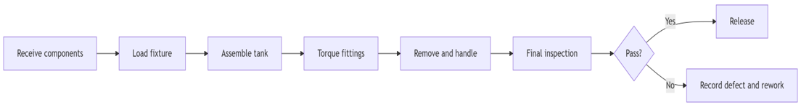
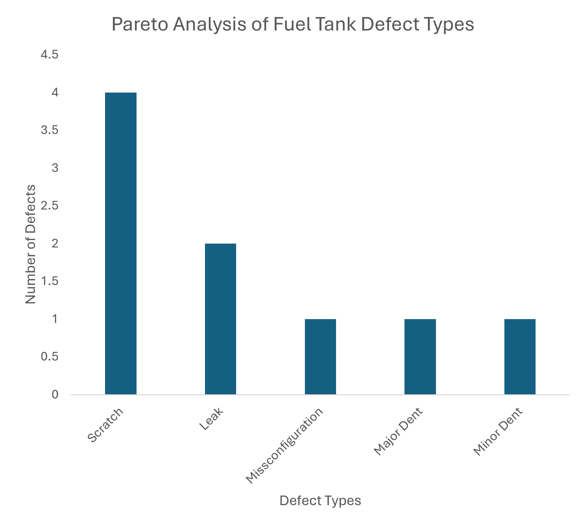
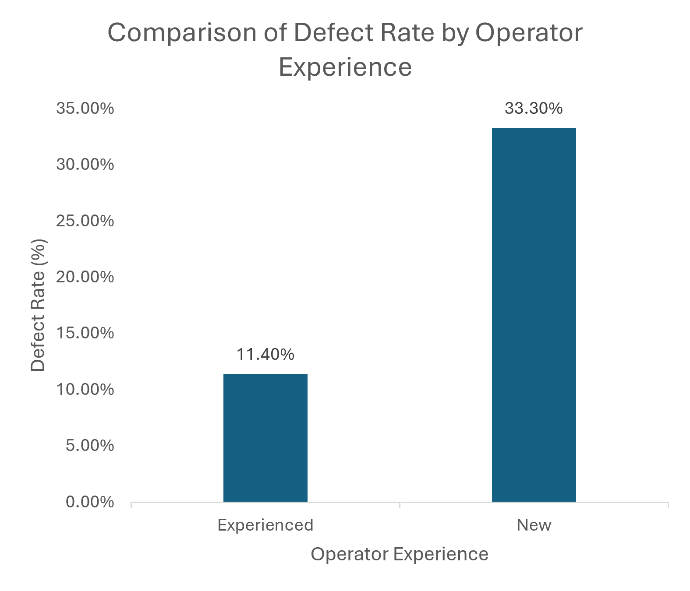
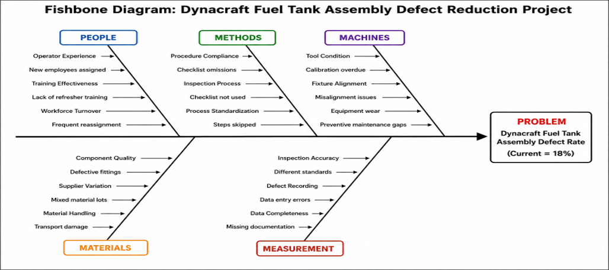
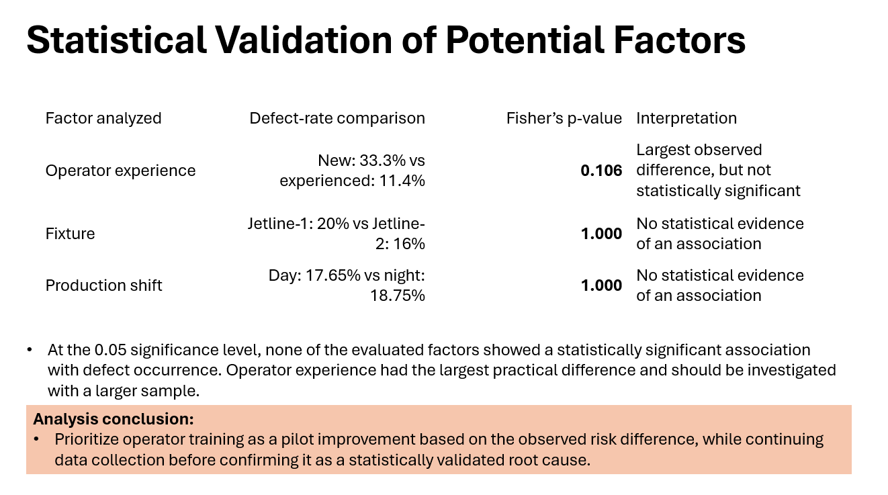
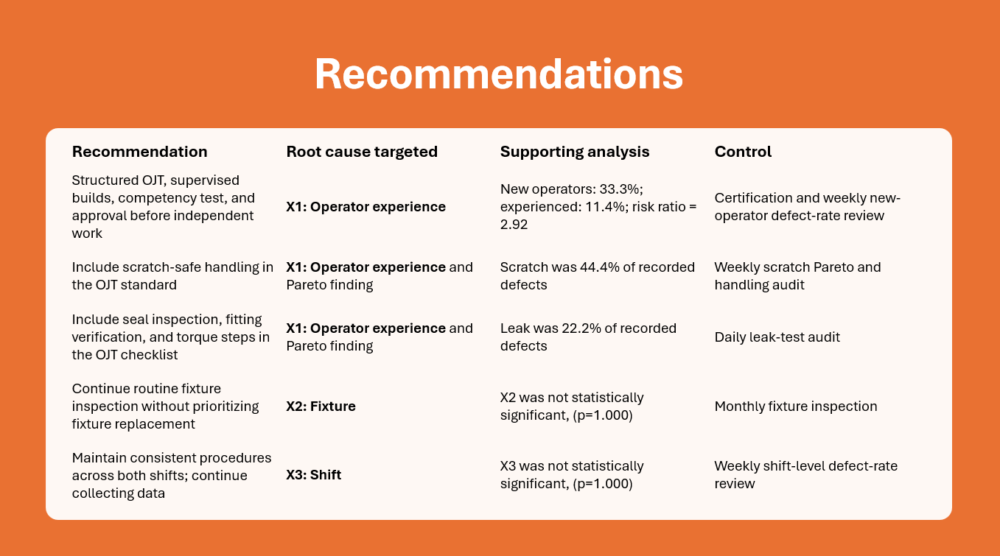
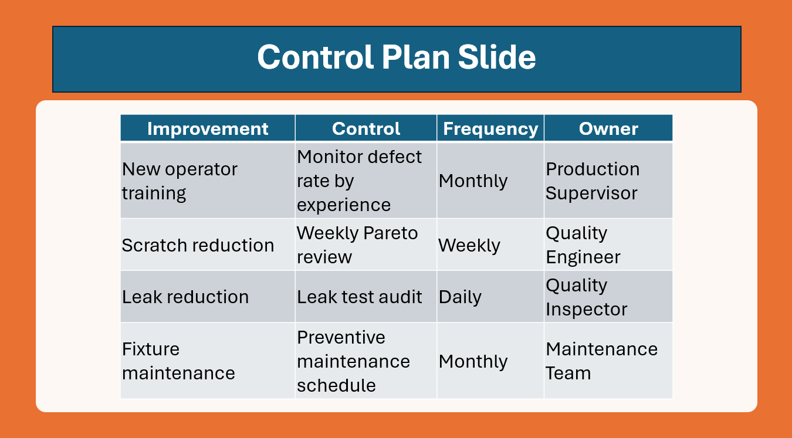

# Manufacturing Defect Reduction Using Lean Six Sigma (DMAIC)

## Project Overview

This project demonstrates the application of the Lean Six Sigma DMAIC methodology to analyze manufacturing defects, identify root causes using statistical analysis, and recommend process improvements to improve product quality and operational performance.

The analysis focuses on identifying the most common defect types, evaluating potential root causes, and recommending practical process improvements and controls.

> Note: This portfolio version has been anonymized. Company-identifying and confidential operational information has been removed or generalized.

## Business Problem

A manufacturing assembly process experienced a baseline defect rate of **18%**, with **9 defective units identified from a sample of 50 inspected products**. Product defects increased rework, inspection effort, material waste, and reduced first-pass yield, resulting in lower operational efficiency.

The objective of this project was to identify the primary drivers of defects using statistical analysis and Lean Six Sigma tools, then develop practical process improvements capable of reducing the defect rate to **below 8%** while improving product quality and manufacturing performance.

## Project Objectives

- Measure the existing manufacturing defect rate
- Identify the most frequent defect categories
- Evaluate relationships between defects and operational factors
- Recommend data driven process improvements 
- Develop a sustainable control plan to maintain quality improvement

## Methodology

The project followed the Lean Six Sigma DMAIC framework:

### Define

Defined the business problem, project scope, customer requirements, and critical-to-quality metric.

### Measure

Collected inspection data for 50 fuel tanks.

Key baseline results:

- Units inspected: 50
- Defective units: 9
- Baseline defect rate: 18%
- DPMO: 180,000
- Estimated sigma level: approximately 2.42

### Analyze

The analysis evaluated:

- Defect type frequency
- Operator experience
- Production fixture
- Work shift
- Possible process causes using a fishbone diagram
- Risk priorities using FMEA

### Improve

Recommended actions included:

- Install protective fixture guards or padding
- Standardize material-handling procedures
- Improve workplace organization using 5S
- Conduct torque audits
- Perform temporary 100% air-pressure testing
- Verify incoming seal lots
- Strengthen structured operator training

### Control

Recommended controls included:

- Daily defect-rate monitoring
- Defect tracking by category
- Layered process audits
- Torque verification
- Rework logging
- Training-completion tracking
- Continued monitoring using statistical process control

## Key Findings

### Defect Frequency

The most common defects were:

| Defect Type | Count | Percentage |
|---|---:|---:|
| Scratch | 4 | 44.4% |
| Leak | 2 | 22.2% |
| Misconfiguration | 1 | 11.1% |
| Major In-Dent | 1 | 11.1% |
| Minor Out-Dent | 1 | 11.1% |

Scratch and leak defects represented 66.7% of all observed defects.

### Operator Experience

- New operators: 5 defects from 15 units, or 33.3%
- Experienced operators: 4 defects from 35 units, or 11.4%
- Observed risk ratio: 2.92
- Fisher's exact test: p = 0.106
  

New operators showed a higher observed defect rate. However, the result was not statistically significant at the 0.05 level, so the analysis does not confirm operator experience as a root cause.

### Fixture

- Fixture 1: 5 defects from 25 units
- Fixture 2: 4 defects from 25 units
- Fisher's exact test: p = 1.000

The sample did not show evidence of a meaningful relationship between fixture and defect status.

### Shift

- Day shift: 6 defects from 34 units
- Night shift: 3 defects from 16 units
- Fisher's exact test: p = 1.000

The sample did not show evidence of a meaningful relationship between shift and defect status.

## Recommendations

1. Prioritize scratch-prevention measures because scratches represented the largest defect category.
2. Introduce fixture padding, handling standards, and 5S controls.
3. Strengthen leak prevention through torque verification, air-pressure testing, and seal inspection.
4. Implement structured training and qualification checklists for new operators.
5. Monitor defects daily by defect type rather than using only the total defect rate.

## Limitations

The analysis was based on a sample of 50 units. The sample was sufficient to identify practical patterns, but additional observations would be needed to increase statistical power and confirm causal relationships.

The recommendations represent proposed improvements. A follow-up data collection period would be necessary to verify the actual post-improvement defect rate.

## Tools and Techniques

- Microsoft Excel
- Lean Six Sigma DMAIC
- Pareto analysis
- Fishbone diagram
  
- Fisher's exact test
- Risk ratio analysis
- Failure Mode and Effects Analysis
- DPMO and sigma-level estimation
- Root-cause analysis
- KPI development

## Skills Demonstrated

- Manufacturing data analysis
- Operations analysis
- Statistical interpretation
  
- Process improvement
- Quality management
- Root-cause analysis
- Data visualization
- Business communication
- Recommendation development
  
- Process control planning
  
## Project Presentation

The complete anonymized case-study presentation is available here:

[View the project presentation](Fuel_Tank_Defect_Reduction_Case_Study.pdf)

## Author

**Bihonegn Aynalem**

M.S. Analytics Candidate, Georgia Institute of Technology
